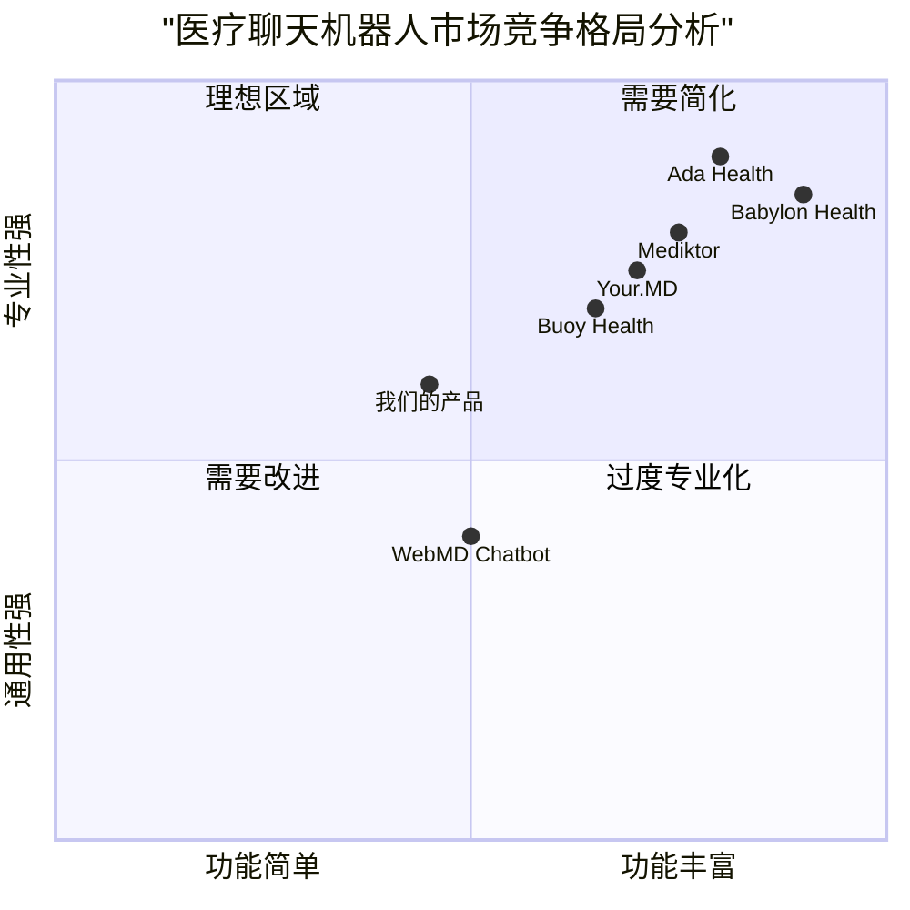
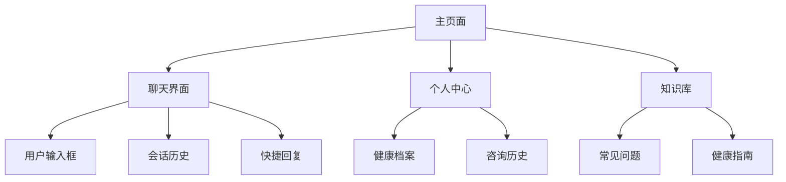

# 轻量级医疗Multi-Agent系统产品需求文档(PRD)

## 1. 产品概述

### 1.1 项目信息
- 项目名称：lightweight_medical_multiagent
- 编程语言：JavaScript + React + Tailwind CSS
- 原始需求：搭建一个非常轻量的医疗multi-agent，主要用gpt的API

### 1.2 产品目标
1. 构建一个基于GPT API的轻量级医疗咨询系统，实现多个智能代理之间的自然交互
2. 提供高效、准确的初步医疗咨询服务，降低医疗资源使用门槛
3. 确保系统响应迅速、交互流畅，同时保护用户隐私和数据安全

### 1.3 用户故事
1. 作为一个普通用户，我想描述我的症状并获得初步诊断建议，以便决定是否需要就医
2. 作为一个慢性病患者，我想获得日常用药和生活建议，以便更好地管理自己的健康状况
3. 作为一个偏远地区的居民，我想通过系统获得基础医疗咨询，以节省往返医院的时间和成本
4. 作为一个关注健康的人，我想了解一些常见疾病的预防知识，以提高自己的健康意识

### 1.4 竞品分析

#### 竞品优劣势分析

1. Ada Health
   - 优势：AI诊断准确度高，支持多语言，用户体验好
   - 劣势：功能过于复杂，部署和维护成本高

2. Babylon Health
   - 优势：提供视频问诊，集成度高
   - 劣势：系统较重，响应速度慢

3. Your.MD
   - 优势：个性化建议，健康教育内容丰富
   - 劣势：功能繁琐，用户引导不足

4. Mediktor
   - 优势：症状检查全面，专业性强
   - 劣势：使用门槛高，交互不够自然

5. Buoy Health
   - 优势：界面简洁，使用方便
   - 劣势：功能相对单一，诊断深度不够

## 2. 技术规格

### 2.1 系统架构

#### 2.1.1 代理角色定义

1. 用户代理(Patient Agent)
   - 负责接收和理解用户输入
   - 管理用户画像和历史记录
   - 确保用户隐私保护

2. 医生代理(Doctor Agent)
   - 分析症状并提供初步诊断
   - 给出用药和就医建议
   - 回答医疗相关问题

3. 知识代理(Knowledge Agent)
   - 管理医疗知识库
   - 提供疾病预防信息
   - 更新医学常识

4. 协调代理(Coordinator Agent)
   - 管理代理间的通信
   - 确保对话流程顺畅
   - 监控系统运行状态

### 2.2 需求池

#### P0级需求（必需功能）
1. 基础问诊功能
   - 症状描述和分析
   - 初步诊断建议
   - 就医建议生成

2. 代理间通信
   - 消息路由系统
   - 状态同步机制
   - 错误处理机制

3. 用户界面
   - 聊天界面
   - 用户信息管理
   - 历史记录查看

#### P1级需求（重要功能）
1. 知识库管理
   - 医疗知识更新
   - 症状库维护
   - 用药指南管理

2. 用户画像系统
   - 健康状况记录
   - 就医历史追踪
   - 个性化建议生成

#### P2级需求（可选功能）
1. 统计分析
   - 使用情况分析
   - 诊断准确率统计
   - 用户满意度追踪

2. 多语言支持
   - 中英文切换
   - 方言理解

### 2.3 UI设计草图

### 2.4 非功能需求

1. 性能要求
   - 系统响应时间：< 2秒
   - 并发用户数：>= 1000
   - API调用延迟：< 1秒

2. 安全要求
   - 数据加密传输
   - 用户信息脱敏
   - 访问权限控制

3. 可用性要求
   - 系统可用性：99.9%
   - 故障恢复时间：< 30分钟
   - 定期备份：每日

### 2.5 开放问题

1. GPT API的调用频率和成本如何优化？
2. 如何确保医疗建议的准确性和合规性？
3. 是否需要引入专业医生进行人工审核？
4. 如何处理紧急医疗情况？
5. 系统扩展性如何保证？

## 3. 项目实施

### 3.1 开发流程
1. 原型开发（2周）
2. 基础功能实现（4周）
3. 测试与优化（2周）
4. 部署上线（1周）

### 3.2 风险评估
1. API调用成本控制
2. 医疗建议准确性
3. 用户隐私保护
4. 系统扩展性

### 3.3 评估指标
1. 用户满意度 > 90%
2. 诊断准确率 > 85%
3. 系统响应时间 < 2秒
4. 日活用户增长率 > 10%